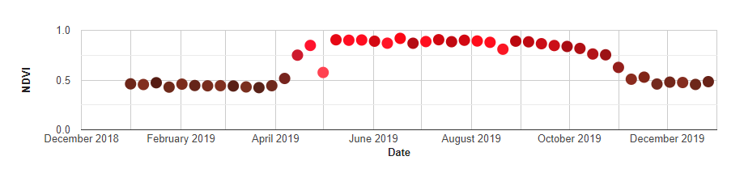
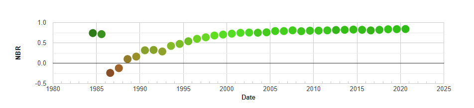
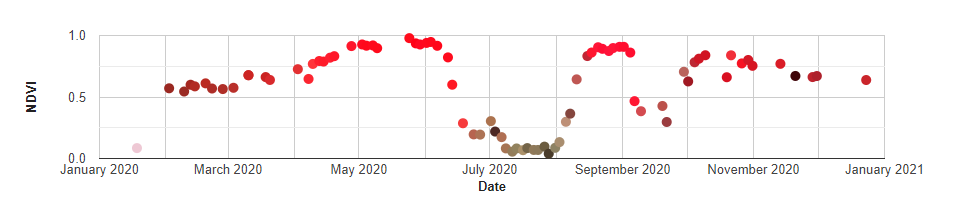

# ee-rgb-timeseries

_For the [Google Earth Engine](https://earthengine.google.com/) JavaScript Code Editor_

Plots a chart to a `ui.Panel` or the Code Editor Console for a multi-band image
time series. Observations are represented as circles whose color is the
stretched RGB representation of three selected bands.

### [**Try the app** — click a point 🖱️, get a Landsat RGB time series chart 📈](https://code.earthengine.google.com/078f1c88b3c9913b5388ef6f773f36a4){:target="_blank"}


## Guide

The steps are:

1. Import the module.
2. Define an area (`ee.Geometry.Polygon`) or point (`ee.Geometry.Point`)
of interest.
3. Build a time series image collection.
4. Define region reduction and chart option parameters.
5. Provide inputs to the [`rgbTs.rgbTimeSeriesChart`](#rgbtimeserieschartcol-aoi-yaxisband-visparams-plothere-optionalparams) function.

Note that the resulting chart can be printed to the console or added to a
`ui.Panel` widget. See the `plotHere` parameter of the
[`rgbTs.rgbTimeSeriesChart`](#rgbtimeserieschartcol-aoi-yaxisband-visparams-plothere-optionalparams)
function (also see the second part of the [MODIS example](#modis-example))

### Module import

Include the following line at the top of every script to import the module.

```js
var rgbTs = require('users/jstnbraaten/modules:rgb-timeseries/rgb-timeseries.js');
```

### MODIS Example



```js
// Import rgb-timeseries module.
var rgbTs = require(
  'users/jstnbraaten/modules:rgb-timeseries/rgb-timeseries.js'); 

// Define a point of interest.
var aoi = ee.Geometry.Point([-93.9447, 35.6814]);

// Get a MODIS 8-day SR collection for 2019.
var modisSr = ee.ImageCollection('MODIS/006/MOD09A1')
  .filterDate('2019-01-01', '2020-01-01');

// Add NDVI as a band to each image in the collection.
var col = modisSr.map(function(img) {
  return img.addBands(
    img.normalizedDifference(['sur_refl_b02', 'sur_refl_b01']).rename('NDVI'));
});

// Define y-axis band.
var Y_AXIS_BAND = 'NDVI';

// Define RGB visualization params; NIR, Red, Green for RGB.
var VIS_PARAMS = {
  bands: ['sur_refl_b02', 'sur_refl_b01', 'sur_refl_b04'],
  min: [50, 50, 50],
  max: [4000, 4000, 4000]
};

// Set region reduction and chart params.
var OPTIONAL_PARAMS = {
  reducer: ee.Reducer.mean(),
  scale: 500,
  crs: 'EPSG:5070',  // Good for CONUS
  chartParams: {
    pointSize: 10,
    legend: {position: 'none'},
    hAxis: {title: 'Date', titleTextStyle: {italic: false, bold: true}},
    vAxis: {title: Y_AXIS_BAND, titleTextStyle: {italic: false, bold: true}},
    explorer: {}
  }
};

// Show aoi on the map.
Map.addLayer(aoi, {color: 'FFF'});
Map.centerObject(aoi, 13);
Map.setOptions('SATELLITE');

// Chart the RGB time series.
rgbTs.rgbTimeSeriesChart(
  col, aoi, Y_AXIS_BAND, VIS_PARAMS, 'console', OPTIONAL_PARAMS);
```

This version of the example adds the chart to a `ui.Panel` widget in the map
instead of the console. Notice that the `plotHere` parameter has changed from
'console' to the name of the `ui.Panel` widget variable.

```js
// Define a ui.Panel widget and add it to the Map.
var chartPanel = ui.Panel({style: {width: '750px', position: 'bottom-left'}});
Map.add(chartPanel);

// Chart the RGB time series to the ui.Panel widget.
rgbTs.rgbTimeSeriesChart(
  col, aoi, Y_AXIS_BAND, VIS_PARAMS, chartPanel, OPTIONAL_PARAMS);
```

### Landsat Example



```js
// Import rgb-timeseries module.
var rgbTs = require(
  'users/jstnbraaten/modules:rgb-timeseries/rgb-timeseries.js'); 

// Import Landsat Collection Builder module.
var lcb = require('users/jstnbraaten/modules:ee-lcb.js'); 

// Define point of interest - a forest harvest in Oregon.
var aoi = ee.Geometry.Polygon(
        [[[-122.16921871927393, 44.51629814192505],
          [-122.16727679994715, 44.51569377237986],
          [-122.16455167558802, 44.517376811231784],
          [-122.16670817163599, 44.51850901001769],
          [-122.16977661874903, 44.51745331184276]]]);

// Set initial ee-lcb params: the date range is for CONUS summer.
lcb.setProps({
  startYear: 1984,
  endYear: 2020,
  startDate: '06-20',
  endDate: '09-10',
  sensors: ['LT05', 'LE07', 'LC08'],
  cfmask: ['cloud', 'shadow'],
  aoi: aoi,
  printProps: false
});

// Define an annual collection plan.
var plan = function(year){
  var col = lcb.sr.gather(year)
    .map(lcb.sr.maskCFmask)
    .map(lcb.sr.addBandNBR);
  return lcb.sr.mosaicMean(col);
};

// Define annual collection year range as ee.List.
var years = ee.List.sequence(lcb.props.startYear, lcb.props.endYear);

// Define constants: use NBR for y-axis, SWIR1, NIR, Green for RGB.
var Y_AXIS_BAND = 'NBR';

var VIS_PARAMS = {
  bands: ['B6', 'B5', 'B3'],
  min: [0, 0, 0],
  max: [4000, 4000, 4000]
};

// Set region reduction and chart params.
var OPTIONAL_PARAMS = {
  reducer: ee.Reducer.mean(),
  scale: 30,
  crs: 'EPSG:5070',  // Good for CONUS
  chartParams: {
    pointSize: 14,
    legend: {position: 'none'},
    hAxis: {title: 'Date', titleTextStyle: {italic: false, bold: true}},
    vAxis: {title: Y_AXIS_BAND, titleTextStyle: {italic: false, bold: true}},
    explorer: {}
  }
};

// Generate annual summer image composite collection.
var col = ee.ImageCollection.fromImages(years.map(plan));

// Show aoi on the map.
Map.addLayer(aoi, {color: 'FFF'});
Map.centerObject(aoi, 15);
Map.setOptions('SATELLITE');

// Chart the RGB annual time series.
rgbTs.rgbTimeSeriesChart(
  col, aoi, Y_AXIS_BAND, VIS_PARAMS, 'console', OPTIONAL_PARAMS);
```

### Sentinel-2 Example



```js
// Import rgb-timeseries module.
var rgbTs = require(
  'users/jstnbraaten/modules:rgb-timeseries/rgb-timeseries.js'); 

// Function to join S2 SR and S2 cloudless.
function getS2SrCldCol(aoi, startDate, endDate) {
  // Import and filter S2 SR.
  var s2SrCol = ee.ImageCollection('COPERNICUS/S2_SR')
    .filterBounds(aoi)
    .filterDate(startDate, endDate);

  // Import and filter s2cloudless.
  var s2CloudlessCol = ee.ImageCollection('COPERNICUS/S2_CLOUD_PROBABILITY')
    .filterBounds(aoi)
    .filterDate(startDate, endDate);

  // Join the filtered s2cloudless collection to the SR collection by the
  // 'system:index' property.
  return ee.ImageCollection(ee.Join.saveFirst('s2cloudless').apply({
    'primary': s2SrCol,
    'secondary': s2CloudlessCol,
    'condition': ee.Filter.equals({
        'leftField': 'system:index',
        'rightField': 'system:index'
    })
  }));
}

// Function to apply s2cloudless mask.
function applyS2Cloudless(img) {
  // Get s2cloudless image, subset the probability band.
  var cldPrb = ee.Image(img.get('s2cloudless')).select('probability');

  // Condition s2cloudless by the probability threshold value.
  var isCloud = cldPrb.gt(cldPrbThresh).rename('clouds');

  // Add the cloud probability layer and cloud mask as image bands.
  return img.select('B.*').updateMask(isCloud.not());
}

// Define cloud probability threshold for s2cloudless masking.
var cldPrbThresh = 50;

// Define a point of interest.
var aoi = ee.Geometry.Point([-119.90168, 45.88911]);

// Get a Sentinel-2 SR collection and apply s2cloudless mask.
var srCol = getS2SrCldCol(aoi, '2020-01-01', '2021-01-01')
  .map(applyS2Cloudless);

// Add NDVI as a band to each image in the collection.
var col = srCol.map(function(img) {
  return img.addBands(
    img.normalizedDifference(['B8', 'B4']).rename('NDVI'));
});

// Define y-axis band.
var Y_AXIS_BAND = 'NDVI';

// Define RGB visualization params; NIR, Red, Green for RGB.
var VIS_PARAMS = {
  bands: ['B8', 'B4', 'B3'],
  min: [50, 50, 50],
  max: [4000, 4000, 4000]
};

// Set region reduction and chart params.
var OPTIONAL_PARAMS = {
  reducer: ee.Reducer.mean(),
  scale: 20,
  crs: 'EPSG:5070',  // Good for CONUS
  chartParams: {
    pointSize: 8,
    legend: {position: 'none'},
    hAxis: {title: 'Date', titleTextStyle: {italic: false, bold: true}},
    vAxis: {title: Y_AXIS_BAND, titleTextStyle: {italic: false, bold: true}},
    explorer: {}
  }
};

// Show aoi on the map.
Map.addLayer(aoi, {color: 'FFF'});
Map.centerObject(aoi, 13);
Map.setOptions('SATELLITE');

// Chart the RGB time series.
rgbTs.rgbTimeSeriesChart(
  col, aoi, Y_AXIS_BAND, VIS_PARAMS, 'console', OPTIONAL_PARAMS);
```

## Components

### rgbTimeSeriesChart(col, aoi, yAxisBand, visParams, plotHere, optionalParams)

Plots a chart to a `ui.Panel` or the Code Editor Console for a multi-band image
time series. Observations are represented as circles whose color is the
stretched RGB representation of three selected bands.

**Kind**: global function  

| Param | Type | Description |
| --- | --- | --- |
| col | `ee.ImageCollection` | An image collection representing a time series of multi-band images. Each image must have a 'system:time_start' |
| aoi | `ee.Geometry` | The region over which to reduce the image data. |
| yAxisBand | <code>String</code> | The name of the image band whose region reduction will be plot along the chart's y-axis. |
| visParams | <code>Object</code> | Visualization parameters that assign bands to red, green, and blue, and the range to stretch color intensity over. |
| visParams.bands | <code>Array</code> | An array of three band names to respectively assign to red, green, and blue for RGB visualization. |
| visParams.min | <code>Array</code> | An array of three band-specific values that define the minimum value to clamp the color stretch range to. Arrange the values in the same order as `visParams.bands` band names. Use units of the input image data. |
| visParams.max | <code>Array</code> | An array of three band-specific values that define the maximum value to clamp the color stretch range to. Arrange the values in the same order as `visParams.bands` band names. Use units of the input image data. |
| plotHere | <code>ui.Panel\|String</code> | Either a `ui.Panel` to add the chart to or 'console' to print the chart to the Code Editor console. |
| optionalParams | <code>Object</code> | Optional. A set of optional parameters to set for controlling region reduction and styling the chart. |
| optionalParams.reducer | <code>ee.Reducer</code> | Optional. The region over which to reduce data. If unspecified, `ee.Reducer.first` is used. |
| optionalParams.crs | <code>String</code> | Optional. The projection to work in. If unspecified, the projection of the first image is used. |
| optionalParams.scale | <code>Number</code> | Optional. A nominal scale in meters of the projection to work in. If unspecified, the nominal scale of the first image is used. |
| optionalParams.chartParams | <code>Object</code> | Optional. ui.Chart parameters accepted by `ui.Chart.setOptions`. See https://developers.google.com/earth-engine/guides/charts_style for more details. |
